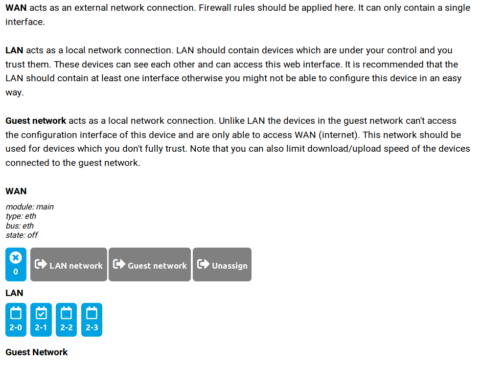
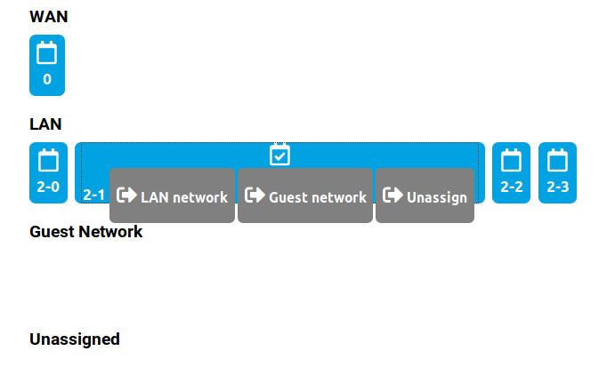

## Interface configuration

_Router and Server workflow_

In this step you can chose which interface you want to use for what.

If you will use your router in regular way, just click on Save and proceed to next step.

If you would like to use your router as AP (Access Point, which will increase the WiFi coverage), you need to move the port from WAN to LAN.

This can be done by clicking on the desired port, where you will see all the details and possibilities of moving port into another interface.

**Attention:**
Look closer on selected LAN port. You can see check mark. That means you got cable connected to this port.

