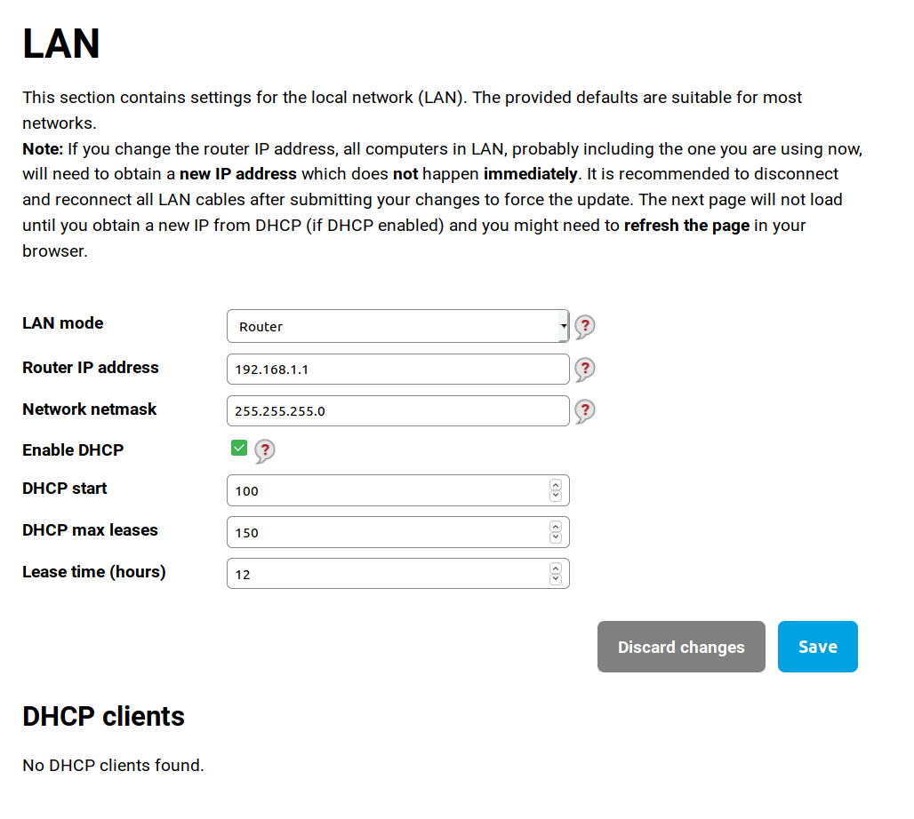
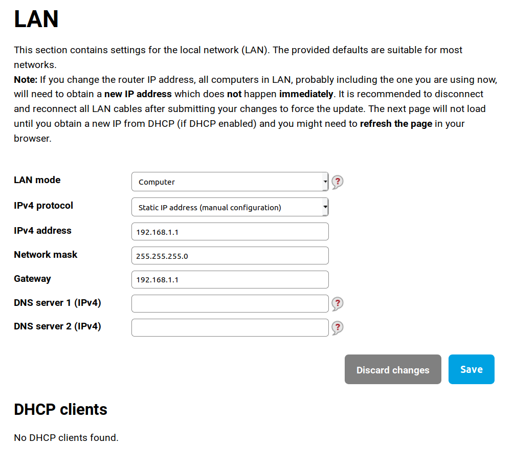

## LAN configuration

_Server workflow only_

In this step you can configure range of IP addresses, which should be in your local network. If you have no special requests, you can just click save and proceed to next step.

There is also difference with configuration router or computer. Router mode means that this devices manages the LAN (acts as a router, can assing IP addresses, ...). Computer mode means that this device acts as a client in this network. It acts in a similar way as WAN, but it has opened ports for configuration interface and other services.

If you need to chose more complicated options, we recommend to use interface LuCI.
