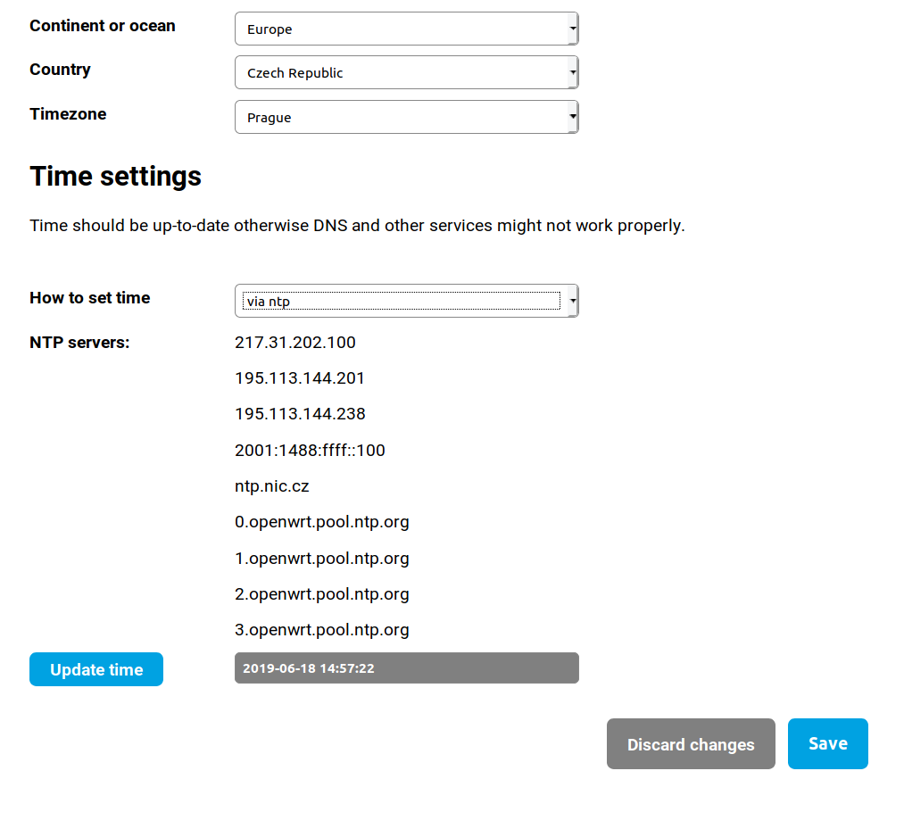

## Region and time

For proper work of your router Turris, you need to have set a right time zone. If the default mid-European time zone is uncomplying for you, you can change that in this step.

We recommend to use NTP. This is Network Time Protocol, which is used to synchronize time on devices with server. By using this protocol, you can avoid unwanted problems and malfunction of the router. \
For keeping the right time router Turris uses a RTC battery. This battery is still in use even when you shut down your Turris, and can run out of voltage, which can bring unwanted troubles. If this happen, you will need to change that battery and configure the time again.

