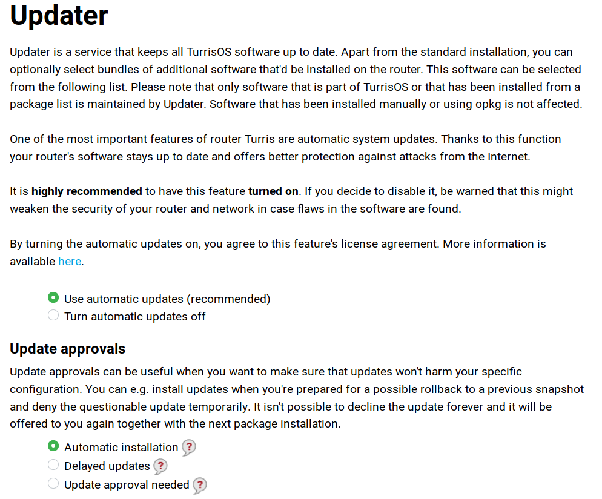

## Updater

Turris router can activate or deactivate the automatic updates. If the automatic updates are enabled, you can install lists of software packages using the Updater. These lists can simplify the installation of software required to turn your router into an NAS (network attached storage) for example, or allow you to connect a printer to the router. The packages will be installed shortly after selecting the desired package lists and pressing the Save changes button.

