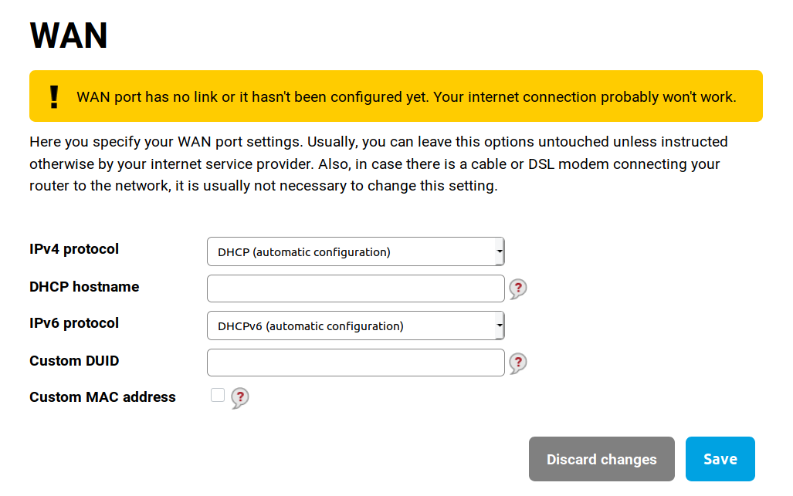

## WAN configuration

_Router workflow_

On this page you configure your connection to internet. In most cases is DHCP (default) configuration enough. In other cases, you should get all needed information from your ISP - static IP address, subnet mask, etc.

