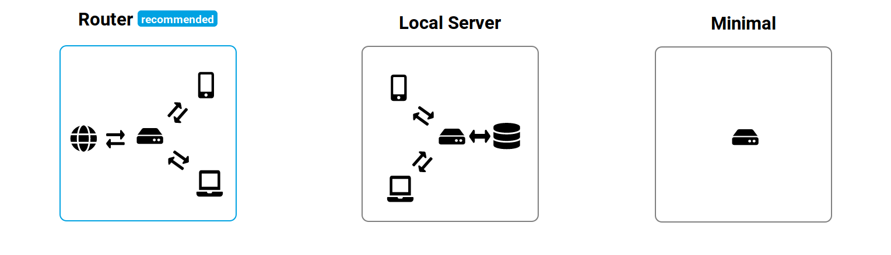
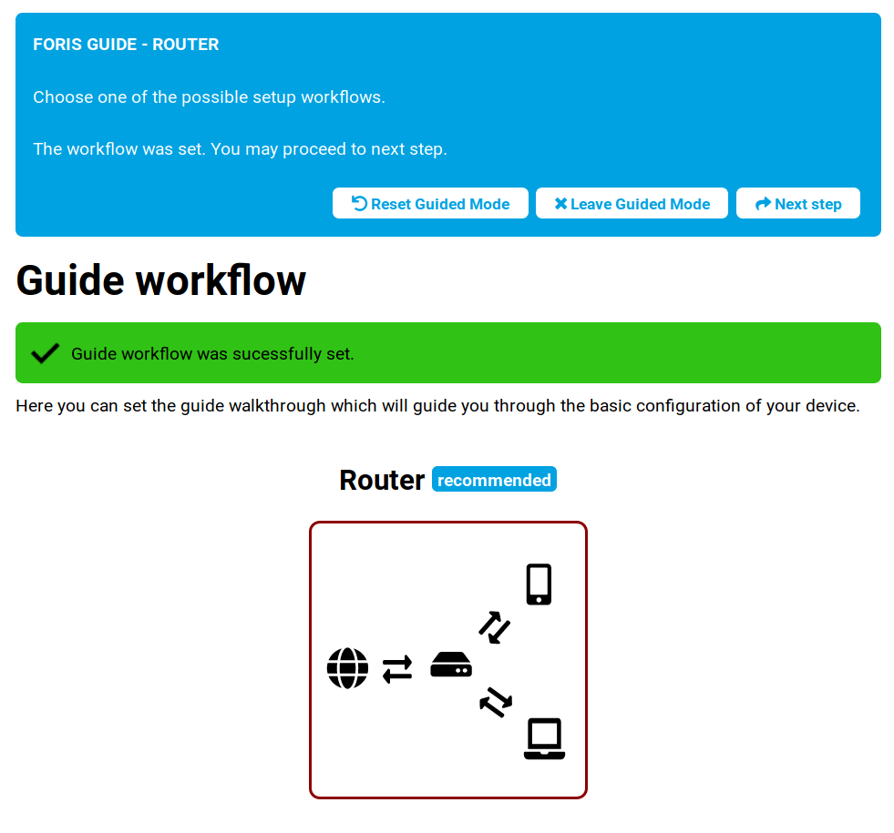
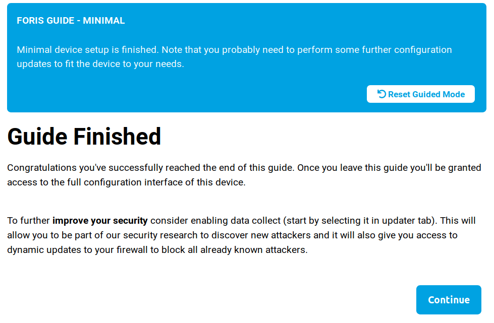

## Guide workflow

In this step, you can choose your workflow guide. You can choose from three various options. The first option, Router, is a more or less basic guide. We recommend to choose this one if you want just connect your router to the worldwide net with basic configuration.

If you plan to use Turris in other ways such as a server, AP, or something else, you can choose from other workflows.

For example, if you choose server workflow, you will get slightly different configuration guide with another default values.

!!The selected workflow will be highlighted with red border.!!

If you want to configure just basics of the router and then configure rest by yourself, choose Minimal workflow. Guide will after this choice end. \
This workflow is recommended only to experienced users, because Turris will not be connected to internet and will not have any configuration after chosing minimal configuration.

This is, how you will see minimal configuration in next step.

