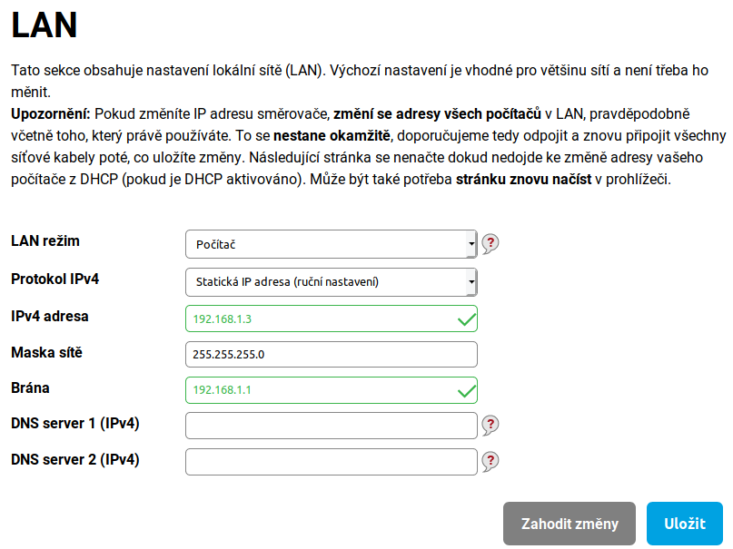
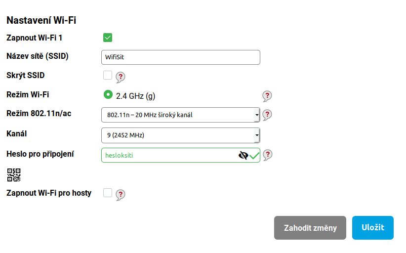
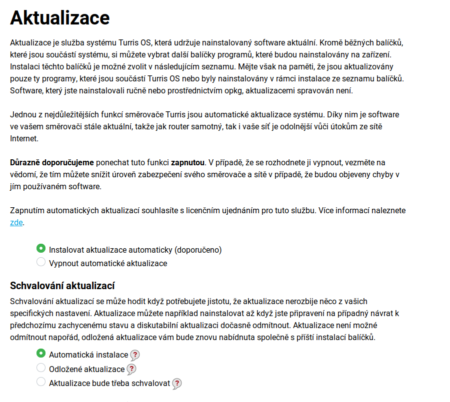

# Rozšíření Wi-Fi sítě

Na hlavním routeru – masteru – nastavíme vhodnou masku lokální sítě, což záleží na předpokládaném počtu uvolněných adres. Budeme počítat s tím, že router má výchozí adresu 192.168.1.1, od toho se nám budou odvíjet další routery.

Každý další routeru budeme nastavovat jako AP, každý bude mít teda jinou statickou adresu, ale musí zůstat ve stejné síti s masterem. V tomhle případě můžeme nastavit např. 192.168.1.2, další by byl .3, atd. Výchozí brána je IP adresa master routeru – 192.168.1.1. Nesmíme zapnout na vypnutí DHCP na všech routerech, krom masteru.

Na každém routeru musí být nastavené stejné SSID a heslo. Pokud používáme jak 2,4GHz, tak 5GHz, je dobré SSID rozlišit například pomocí „-5G“. Nicméně heslo necháváme stejné pro obě SSID.
Je doporučeno pro každé SSID stejného ražení nastavit jiný kanál. Sítě se pak nebudou tolik vzájemně rušit a naopak dojde k lepšímu pokrytí signálem.

Dále je důležité nezapomenout zapnout automatické aktualizace. Tyto aktualizace udrží systém aktuální a tím omezí šanci, že něco nebude fungovat tak, jak má a zabezpečení routeru zůstane taktéž aktuální.

Nyní přejdeme k dalšímu kroku, což bude nastavení vlanu v administračním rozhraní LuCI, které najdete na IP adrese 192.168.1.1.
